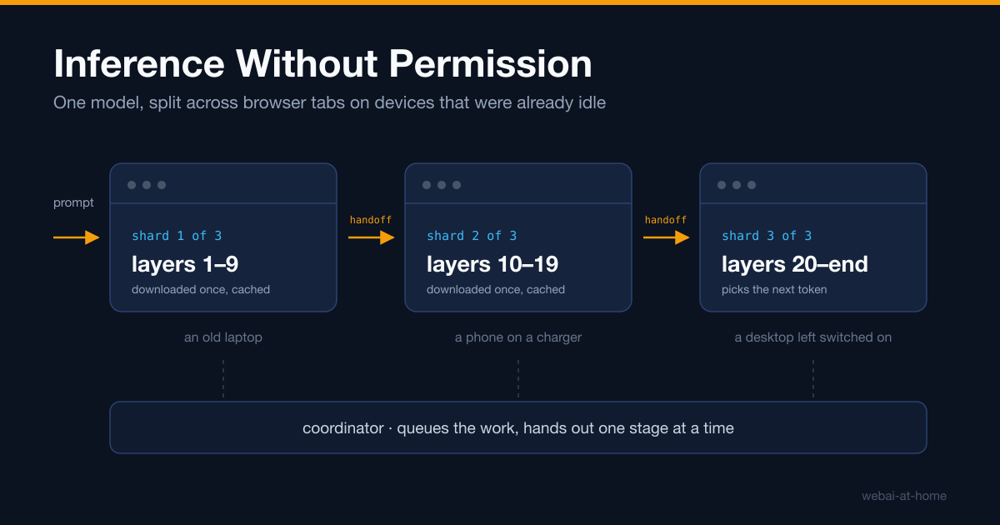

# Inference Without Permission

There are two ways to run a large language model today.

You can pay a company. You send your text to somebody else's data centre, you accept their terms, their prices, their availability, and their decision about what the model will and will not answer.

Or you can buy a graphics card. That works, and it is genuinely yours, but it costs more than most people will spend on a hobby, and it puts a hardware purchase between a person and the ability to compute.

Both of these are forms of permission. In the first case you ask a company. In the second you ask your bank. Neither is a technical limit — it is not that the computing capacity does not exist. It is that the capacity which exists is not arranged in a way that ordinary people can use.

`webai-at-home` is my attempt to arrange it differently. It asks whether a group of ordinary people, using the devices they already own, can run a language model together without asking anyone for permission to do it.

> The complete project is open source: [github.com/webai-at-home/webai-at-home](https://github.com/webai-at-home/webai-at-home)



## The Capacity Is Already Here

Look around the room you are in. Count the devices that are switched on and doing nothing.

An old laptop that was replaced but never thrown away. A phone on a charger overnight. A desktop machine left on because turning it off is a nuisance. A tablet in a drawer that still works perfectly well and still has a graphics processor in it.

Each one of these is far too weak to run a useful language model on its own. That is the whole reason they are idle rather than useful. But there are an enormous number of them, and their combined memory and computing capacity is not small. It is simply scattered.

The interesting question is not whether that capacity exists. It plainly does. The question is what it would take to use it, and specifically what it would take to use it without anyone having to install anything, create an account, or trust a stranger's executable file.

## The Browser Is the Last Platform Without a Gatekeeper

This is where the web browser stops being an implementation detail and becomes the entire point.

Every other way of getting code onto a stranger's device requires somebody's approval. A mobile application needs an app store to accept it. A desktop application needs the person to download an executable file, ignore a security warning, and trust you. A background service needs administrative rights on the machine.

A web page needs a link.

That is the only distribution channel left where a person can contribute computing time to something in under ten seconds, with no installer, no account, no permission from a platform owner, and no lasting change to their device. They open a page. It runs. They close the tab and it is over, with nothing left behind.

If volunteer computing for language models is going to work at all, this is where it has to happen. Not because the browser is the fastest place to run a model — it is not — but because it is the only place where the invitation costs nothing to accept.

## One Model, Many Devices

Here is the technical problem that makes this hard.

A language model is a stack of layers. Text goes in at the bottom, passes through every layer in order, and a prediction comes out at the top. To run the model you need all of the layers, and for anything worth using, all of the layers do not fit on a volunteer's old laptop.

There are two well-known ways to spread a model across several machines.

The first is to split every layer across all the devices, so each device holds a slice of every layer and they all work on the same layer at the same time. This is fast when the machines sit in the same rack on a fast network. It is hopeless here, because it requires every device to synchronise with every other device after every single operation, and my volunteers are on home internet connections with different speeds, different reliability, and different owners who did not agree to anything.

The second is **pipeline parallelism**, and it is the one this project uses. Instead of splitting each layer, you split the stack. The first device holds the first group of layers. The second device holds the next group. The third holds the rest. A value enters the first device, comes out the other side, travels to the second device, and so on to the end.

The reason this fits volunteer computing is the shape of what has to travel between devices. Each device passes along one result — a small handful of numbers — and then it is done with its part. There is no constant synchronisation, no all-to-all communication, and no requirement that the devices be anywhere near each other. Each device downloads only its own group of layers, so nobody has to hold the whole model, and nobody has to download it either.

That is the bet. Now let me show you the smallest part of it that actually runs.

## Five Becomes Seventeen

Before running a model across two strangers' devices, you have to be able to run *anything* across two strangers' devices. So the first thing I built was a task so simple that nothing about the result can depend on a model, a graphics processor, or how fast anyone's laptop is.

It multiplies a number by two, and then adds seven.

The work is split into two stages. The first stage multiplies. The second stage adds. They are deliberately given to different browser tabs, on different devices where possible, and the coordinator moves the value from the first to the second.

Start the coordinator:

```bash
npm run dev --workspace @webai/gateway
```

Start the worker page and open it in two browser tabs:

```bash
npm run dev --workspace @webai/worker-webpage
```

Submit the number five:

```bash
npm run sample:dev_formula --workspace @webai/consumer-cli
```

The answer that comes back is seventeen. Five times two is ten, in the first tab. Ten plus seven is seventeen, in the second tab.

I am aware of how unimpressive that sounds. It is meant to be unimpressive. The arithmetic is worthless on purpose, because it means everything that *did* happen is coordination and nothing else:

- A client submitted a task without knowing which devices would run it, or how many.
- The coordinator chose a pipeline, copied its ordered list of stages onto the task, and handed out the first stage.
- A browser tab claimed that stage under a lease with an expiry, did the work, and returned a result.
- The coordinator found the next stage, deliberately preferred a *different* device for it, and handed it out.
- The second tab returned a value that became the task's result.

Every one of those steps is the same code path that a language model task uses. Swap the arithmetic for a group of model layers and the coordination does not change. That is the point of building the trivial version first: it separates "can these devices cooperate at all?" from "can a browser run a model?", so that when something breaks you know which of the two questions you are looking at.

## What Runs Today

The project is early, and I would rather tell you exactly where it is than imply more.

The coordinator currently runs several kinds of task. Alongside the arithmetic one, there is **Qwen3-0.6B split into three shards** — three consecutive groups of the model's layers — with each shard run by a different browser tab. The three tabs together produce one token of output, then the pipeline runs again from the first tab for the next token, and again, until the model signals that the answer is finished. Each tab downloads only its own shard and keeps it in the browser's local storage, so the download happens once per device rather than once per request.

There is also a task that uses the **Gemma Nano model built into Chrome**, where the browser already holds the model and this project holds none of it, and a task that runs the **complete Qwen3.5-0.8B model** in a single tab. The models run through ONNX Runtime Web, using the graphics processor where the browser offers one and falling back to running on the main processor where it does not.

These are small models. A real answer to the permission problem needs bigger ones, and the honest position is that the hardest questions are still open: how a coordinator can verify that a volunteer returned real work rather than convincing noise, how much a browser tab is slowed down when it sits in the background where volunteer work actually happens, and how to divide a model sensibly across devices that differ enormously from one another.

I would rather write about those open questions than pretend they are closed.

## Why This Is Deliberately Not a Chat Service

One design decision shapes everything else: this is built for work that can wait.

A request here is allowed to take hours. That single allowance is what makes volunteer computing practical, because it turns every hard problem into a survivable one. A volunteer closes their tab in the middle of a task — fine, the work is given to somebody else. A device is slow — fine, it still contributes. A connection drops for a minute — fine, there is a queue and a deadline generous enough to absorb it.

If I insisted on chat-speed answers, none of that would be true, and every one of those ordinary events would become a failure. Batch work is not a limitation I am apologising for. It is the concession that makes the rest possible.

## Where This Is Going

The claim I am making is that inference should not require anyone's permission, and that the hardware to make that true is already sitting in people's homes, switched on and doing nothing.

The next post is about the part that makes it hard: every worker in this system can vanish at any moment, without warning and without apology, and the whole architecture is shaped by taking that as the starting assumption rather than as an error to be handled at the edges.

The code is at [github.com/webai-at-home/webai-at-home](https://github.com/webai-at-home/webai-at-home). It runs locally today, and I would rather have your objections early than your applause late.
