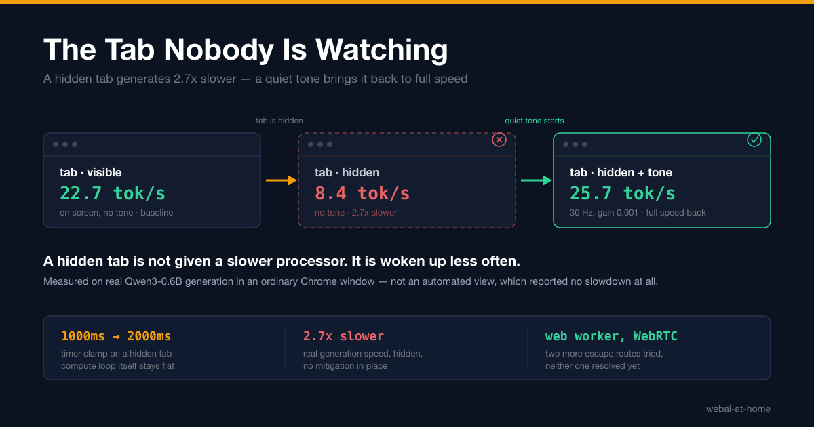

# The Tab Nobody Is Watching

The [previous post](./post_3_change_one_line.blog_post.md) closed on an open question rather than an answer: a worker in `webai-at-home` is a browser tab that nobody is looking at, and Chrome deliberately slows down a tab that nobody is looking at. If that slowdown is severe enough, volunteering a device is worthless in exactly the situation volunteering is meant to happen in — while the owner has moved on to something else. I said at the time that this was the measurement that decides whether any of the rest of the project matters, and a question that size does not belong in a paragraph at the end of a post about something else. So it got its own package of experiments, and now it gets its own post.

> The complete project is open source: [github.com/webai-at-home/webai-at-home](https://github.com/webai-at-home/webai-at-home)

The experiments live in `packages/_idle_experiments`, built for [issue #83](https://github.com/webai-at-home/webai-at-home/issues/83), and every one of them is a plain page with a log, not a benchmark suite with a framework around it. Open it, move the window around, read what changed.

## Two Different Slowdowns, Not One

The first experiment does nothing but calibrate. Once a second, for as long as the page is open, it records the tab's visibility state, whether the window has focus, how far a timer asked to fire after 1000 milliseconds actually drifts, how many animation frames arrived since the last tick, and how long a fixed 15,000,000-iteration computation loop takes.

Hide the tab and two of those numbers move, and one does not. The 1000 millisecond timer settles into firing every 1990 to 2000 milliseconds — the documented once-per-second clamp Chrome applies to a hidden tab. Animation frames stop arriving entirely, every tick reporting zero. And the computation loop, measured across the same stretch, stays flat at 220 to 253 milliseconds, exactly what it measured on screen.

That third number is the one worth sitting with. A hidden tab is not given a slower processor. It is woken up less often. Those are different problems, and they have different fixes: nothing helps a tab that is asleep, but a tab that is awake and merely called rarely can still get through the same amount of work per wake-up, provided the work does not depend on being woken every second to make progress. Separating those two effects before touching any production code is the entire reason this experiment exists.

## The Number That Actually Matters

A synthetic loop is a stand-in. The real question is what happens to actual model generation, so the second experiment loads Qwen3-0.6B-ONNX through ONNX Runtime Web and generates an answer to the same fixed prompt over and over, logging tokens per second against the tab's visibility and focus at the time.

Measured on 2026-08-05 in a real Chrome window, on WebGPU, 26 tokens per generation cycle:

| Condition | Cycles | Mean tokens per second |
| --- | --- | --- |
| On screen, no tone | 53 | 22.7 |
| Hidden, no tone | 52 | **8.4** |

A hidden tab generates about 2.7 times slower with no mitigation in place. That is the number the whole project's usefulness turns on, and it is worse than the timer clamp alone would predict — a tab woken half as often should still finish each unit of work at full speed, by the logic of the first experiment, and generation clearly does not.

## One Documented Exemption, Tested Directly

Chrome's own [background tabs article](https://developer.chrome.com/blog/background_tabs) lists audio playback among the exemptions from background-tab timer throttling. Rather than take that on faith, the third experiment plays a 30 hertz tone at a gain of 0.001 — faint to inaudible, and deliberately not silent, because a tone at exactly zero gain may not count as "playing audio" to whatever heuristic Chrome is actually running — and repeats the calibration measurement with it running.

The moment the tone starts, timer drift on a hidden tab drops from roughly +1000 milliseconds to between +0 and +3 milliseconds, and stays there. The computation loop was never slowed to begin with, so this experiment on its own proves the tone removes the clamp and nothing about generation speed. That question belongs to the model, so the tone was added to the generation experiment too, carried behind a button, with every logged cycle recording whether it was playing:

| Condition | Cycles | Mean tokens per second |
| --- | --- | --- |
| On screen, tone running | 52 | 25.3 |
| Hidden, tone running | 170 | **25.7** |

With the tone playing, the penalty does not shrink. It disappears. A hidden tab generates as fast as a visible one, and stays there across three separate hidden stretches in the same run rather than decaying back toward the unmitigated number. The honest caveat: the no-tone and tone-running figures come from two separate sessions rather than one continuous log containing both, because the tone was started before generation began in the second run. The effect is far too large — a 3x recovery — to be an artefact of that, but the tidy version of the evidence, all four groups in one uninterrupted log, has not been captured yet.

## The Trap of Testing This the Easy Way

One result from this package is worth more than its place in a table suggests, because it is not a measurement of the browser. It is a measurement of how easy it is to fool yourself while testing the browser.

An earlier attempt to measure generation speed against visibility ran inside an embedded, automated browser view rather than an ordinary Chrome window a person opens and clicks into. It reported 25.1 tokens per second while the tab called itself hidden — no slowdown at all — and the tempting conclusion was that hiding a tab costs nothing, so none of this needed solving.

That conclusion was wrong, and it was wrong in a way that would not have announced itself. `document.visibilityState` reported `hidden` correctly. The number that came back was simply the number an unthrottled tab produces, because the automated view driving it was never actually put in the background the way Chrome's real scheduler recognizes — it kept driving the page at full speed regardless of what the page said about itself. Only a real, ordinary browser window, hidden by actually switching away from it, reproduces the real behaviour. Every number in this post was re-measured that way after this one came back wrong.

## What Didn't Resolve Cleanly

Not every experiment in the package landed on a clean answer, and the honest version of this post says so rather than quietly dropping the ones that didn't.

**Web Worker offload** runs the identical computation loop on the main thread and on a dedicated Web Worker at once, on the idea that work off the main thread might be protected from whatever a hidden tab does to it. For the first fifteen seconds hidden, the worker's loop held steady while the main thread's timer was already clamped — offloading looked like it was working. Then both the worker and the main thread collapsed together, to five or six times slower than either had been. That collapse did not reproduce in the audio-tone experiment, which sat hidden for over two minutes in the same session with its own computation loop flat throughout, so the most likely explanation is that running two continuous loops at once saturated the processor on that particular run rather than this being real browser behaviour. It needs to be rerun before anyone builds on it, and a follow-up page that runs the worker offload and the quiet tone together to see whether the tone prevents the collapse has been written but not yet run.

**The WebRTC data channel experiment** — testing the other documented exemption, real-time connections — never reached a usable state. Two `RTCPeerConnection` objects were meant to connect to each other inside the same page over the loopback address, but the connection sat at `connecting` for over twenty seconds with no round trips and no console errors, in a sandboxed browser environment used for that attempt. The negotiation code was read through afterward and looks correct, so the likely explanation is that candidate gathering was blocked by the sandbox rather than by anything wrong with the page. This one has to be retried in an ordinary desktop Chrome window before it counts as evidence either way.

**The offscreen document extension** tests the most structurally promising idea in the package — a `chrome.offscreen` document that never belongs to any tab or window, so there is nothing to background in the first place — but loading a Developer Mode extension requires a real Chrome profile and the `chrome://extensions` interface, which could not be driven the same way the page-based experiments were. It was built and syntax-checked and nothing more. Treat it as unverified until someone has actually loaded it and watched the log across an hour of Chrome sitting in the background.

## Where This Leaves the Worker Webpage

One mitigation in this package has a clean result against a real model rather than a synthetic stand-in, reproduced across a full run rather than a single lucky measurement, with a documented mechanism behind it: the quiet tone. A hidden tab with the tone playing generated as fast as a visible one, every time it was tried. Everything else in the package is either unresolved, unreproduced, or untested end to end, and none of it should be mistaken for a settled question just because a page exists that tests it.

So the near-term answer for the worker webpage is the boring one: play an inaudible tone while it works, because that is the only escape route with real evidence behind it. The offscreen document is the more interesting long-term direction — sidestepping the problem entirely rather than working around it a tab at a time — but "interesting" and "verified" are not the same word, and this package is careful to keep them apart.

The code is at [github.com/webai-at-home/webai-at-home](https://github.com/webai-at-home/webai-at-home), the experiments are in `packages/_idle_experiments`, and the honest state of each one is in its own README rather than only in this summary.
